## 1. 产品概述

睡眠门诊综合管理工作台是一套面向睡眠门诊医生、护士和随访专员的 Web 应用，整合 PSQI 量表评估、风险分层管理和复诊追踪功能，替代传统纸笔登记和人工追踪方式，提升门诊工作效率。

- **核心价值**：帮助门诊团队快速判断患者优先级（谁该先回访、谁需要加号复诊、谁可以继续居家观察）
- **目标用户**：睡眠门诊医生、护士、随访专员
- **解决痛点**：减少纸笔登记繁琐、人工追踪遗漏、患者管理混乱等问题

## 2. 核心功能

### 2.1 用户角色

| 角色 | 注册方式 | 核心权限 |
|------|----------|----------|
| 医生 | 系统分配账号 | 患者建档、PSQI评估录入、风险分层、复诊建议、随访结论、查看统计 |
| 护士 | 系统分配账号 | 患者列表查看、随访任务执行、触达记录、未完成提醒 |
| 随访专员 | 系统分配账号 | 随访计划管理、电话/短信触达、随访记录、预警处理 |

### 2.2 功能模块

1. **患者列表**：患者档案管理、筛选搜索、快速查看
2. **评估录入**：初诊建档、PSQI量表分项录入、总分自动计算、失眠主诉备注、风险分层标记
3. **随访计划**：复诊时间建议、随访任务自动生成、电话/短信触达记录、干预记录
4. **预警看板**：异常高分预警、未完成量表提醒、优先级排序
5. **统计报表**：症状变化对比、干预效果分析、工作量统计

### 2.3 页面详情

| 页面名称 | 模块名称 | 功能描述 |
|----------|----------|----------|
| 患者列表 | 患者档案卡 | 展示患者基本信息、最新PSQI评分、风险等级、下次随访时间 |
| 患者列表 | 搜索筛选 | 按姓名、风险等级、随访状态、日期范围筛选 |
| 患者列表 | 快速操作 | 新增患者、查看详情、快速录入评估 |
| 评估录入 | 初诊建档 | 录入患者基本信息、病史、用药史 |
| 评估录入 | PSQI量表 | 7个分项录入、总分自动计算（0-21分） |
| 评估录入 | 风险分层 | 根据PSQI总分自动分层（轻度/中度/重度） |
| 评估录入 | 主诉备注 | 失眠症状描述、持续时间、影响程度 |
| 评估录入 | 复诊建议 | 医生建议复诊时间、干预方案 |
| 随访计划 | 任务列表 | 待随访、已完成、逾期任务分类展示 |
| 随访计划 | 触达记录 | 电话记录、短信记录、沟通内容留档 |
| 随访计划 | 干预记录 | 用药记录、非药物干预记录（CBT-I等） |
| 随访计划 | 症状对比 | 前后两次PSQI评分对比图表 |
| 预警看板 | 高分预警 | PSQI≥15分患者红色预警，自动置顶 |
| 预警看板 | 未完成提醒 | 逾期未完成量表患者提醒 |
| 预警看板 | 优先级排序 | 按风险等级、逾期天数排序 |
| 预警看板 | 快速处理 | 一键电话、加号复诊、标记观察 |
| 统计报表 | 症状趋势 | 科室整体PSQI评分趋势图 |
| 统计报表 | 分层占比 | 轻中重度患者占比饼图 |
| 统计报表 | 随访统计 | 随访完成率、触达成功率 |
| 统计报表 | 干预效果 | 不同干预方案效果对比 |

## 3. 核心流程

```mermaid
flowchart LR
    A["初诊建档"] --> B["PSQI量表录入"]
    B --> C["总分自动计算"]
    C --> D["风险分层标记"]
    D --> E["医生复诊建议"]
    E --> F["随访任务自动生成"]
    F --> G["护士/专员执行随访"]
    G --> H["电话/短信触达记录"]
    H --> I["干预记录录入"]
    I --> J["复诊评估"]
    J --> K["症状前后对比"]
    K --> L["更新风险分层"]
    L --> M["随访结论留档"]
```

## 4. 用户界面设计

### 4.1 设计风格
- **主色调**：医疗蓝 (#165DFF) - 专业、可信赖
- **辅助色**：警示红 (#F53F3F) - 高风险预警、薄荷绿 (#00B42A) - 低风险、琥珀橙 (#FF7D00) - 中风险
- **中性色**：深灰 (#1D2129) 正文、中灰 (#4E5969) 辅助文字、浅灰 (#C9CDD4) 边框、极浅灰 (#F2F3F5) 背景
- **按钮风格**：圆角 8px，主按钮实心蓝色，次按钮描边蓝色
- **字体**：标题使用思源黑体 Bold，正文使用思源黑体 Regular，数字使用等宽字体
- **布局风格**：卡片式布局，顶部导航 + 左侧菜单栏，清晰的信息层级
- **图标风格**：线性图标，使用 lucide-react 图标库

### 4.2 页面设计概述

| 页面名称 | 模块名称 | UI 元素 |
|----------|----------|----------|
| 患者列表 | 档案卡 | 卡片悬浮阴影、风险等级色标、状态标签、hover 过渡动画 |
| 评估录入 | PSQI量表 | 分组表单、实时计算总分、进度指示器、提交确认弹窗 |
| 随访计划 | 任务看板 | 时间线布局、状态流转动画、快捷操作按钮 |
| 预警看板 | 预警卡片 | 红色渐变边框、闪烁动画、优先级徽章、一键操作区 |
| 统计报表 | 数据图表 | 平滑折线图、环形图、数据卡片、渐变色填充 |

### 4.3 响应式
- **桌面优先**设计，适配 1366px 及以上分辨率
- 左侧菜单在小屏幕可折叠
- 表格支持横向滚动
- 触控设备优化按钮点击区域

### 4.4 交互细节
- 页面加载时数据渐入动画（staggered reveal）
- 表格行 hover 高亮
- 表单输入时的实时验证反馈
- 预警卡片的轻微呼吸动画
- 数据更新时的数字滚动动画
- 弹窗的缩放过渡效果
