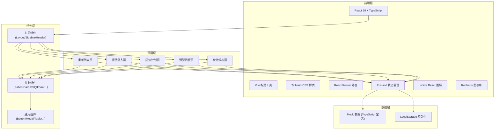
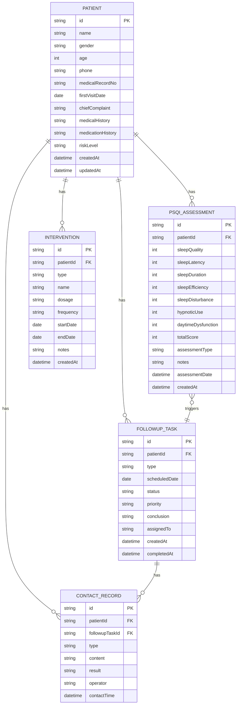

## 1. 架构设计



## 2. 技术描述

- **前端框架**：React 18 + TypeScript
- **构建工具**：Vite 5
- **样式方案**：Tailwind CSS 3
- **路由管理**：React Router DOM 6
- **状态管理**：Zustand 4
- **图标库**：Lucide React
- **图表库**：Recharts
- **数据持久化**：LocalStorage
- **数据来源**：Mock 数据（TypeScript 类型定义）

## 3. 路由定义

| 路由 | 页面 | 说明 |
|------|------|------|
| `/` | 患者列表 | 首页，展示所有患者档案 |
| `/patients` | 患者列表 | 患者列表页 |
| `/assessment` | 评估录入 | PSQI量表评估录入 |
| `/assessment/new` | 新建评估 | 新建患者初诊评估 |
| `/assessment/:patientId` | 患者评估 | 指定患者的评估录入 |
| `/followup` | 随访计划 | 随访任务管理 |
| `/alerts` | 预警看板 | 高风险患者预警 |
| `/reports` | 统计报表 | 数据统计分析 |

## 4. 数据模型

### 4.1 数据模型定义



### 4.2 TypeScript 类型定义

```typescript
// 患者基本信息
export interface Patient {
  id: string;
  name: string;
  gender: 'male' | 'female';
  age: number;
  phone: string;
  medicalRecordNo: string;
  firstVisitDate: string;
  chiefComplaint: string;
  medicalHistory: string;
  medicationHistory: string;
  riskLevel: 'mild' | 'moderate' | 'severe';
  createdAt: string;
  updatedAt: string;
}

// PSQI 评估记录
export interface PSQIAssessment {
  id: string;
  patientId: string;
  sleepQuality: number;      // 1.睡眠质量
  sleepLatency: number;      // 2.入睡时间
  sleepDuration: number;     // 3.睡眠时间
  sleepEfficiency: number;   // 4.睡眠效率
  sleepDisturbance: number;  // 5.睡眠障碍
  hypnoticUse: number;       // 6.催眠药物
  daytimeDysfunction: number; // 7.日间功能障碍
  totalScore: number;
  assessmentType: 'initial' | 'followup';
  notes: string;
  assessmentDate: string;
  createdAt: string;
}

// 随访任务
export interface FollowupTask {
  id: string;
  patientId: string;
  type: 'phone' | 'sms' | 'visit';
  scheduledDate: string;
  status: 'pending' | 'in_progress' | 'completed' | 'overdue';
  priority: 'low' | 'medium' | 'high' | 'urgent';
  conclusion: string;
  assignedTo: string;
  createdAt: string;
  completedAt: string;
}

// 干预记录
export interface Intervention {
  id: string;
  patientId: string;
  type: 'medication' | 'non_medication';
  name: string;
  dosage: string;
  frequency: string;
  startDate: string;
  endDate: string;
  notes: string;
  createdAt: string;
}

// 触达记录
export interface ContactRecord {
  id: string;
  patientId: string;
  followupTaskId: string;
  type: 'phone' | 'sms' | 'visit';
  content: string;
  result: 'success' | 'failed' | 'no_answer';
  operator: string;
  contactTime: string;
}

// PSQI 评分标准
export const PSQI_SCORING = {
  sleepQuality: { max: 3, description: '睡眠质量' },
  sleepLatency: { max: 3, description: '入睡时间' },
  sleepDuration: { max: 3, description: '睡眠时间' },
  sleepEfficiency: { max: 3, description: '睡眠效率' },
  sleepDisturbance: { max: 3, description: '睡眠障碍' },
  hypnoticUse: { max: 3, description: '催眠药物' },
  daytimeDysfunction: { max: 3, description: '日间功能障碍' },
};

// 风险分层标准
export const RISK_LEVELS = {
  mild: { min: 0, max: 7, label: '轻度', color: 'green' },
  moderate: { min: 8, max: 14, label: '中度', color: 'orange' },
  severe: { min: 15, max: 21, label: '重度', color: 'red' },
};
```

## 5. 项目目录结构

```
src/
├── components/          # 公共组件
│   ├── Layout/
│   │   ├── index.tsx   # 主布局
│   │   ├── Sidebar.tsx # 侧边栏
│   │   └── Header.tsx  # 顶部导航
│   ├── ui/
│   │   ├── Button.tsx
│   │   ├── Card.tsx
│   │   ├── Modal.tsx
│   │   ├── Badge.tsx
│   │   ├── Input.tsx
│   │   ├── Select.tsx
│   │   ├── Table.tsx
│   │   └── FormItem.tsx
│   ├── PatientCard.tsx
│   ├── PSQIForm.tsx
│   ├── FollowupTaskCard.tsx
│   ├── AlertCard.tsx
│   └── ScoreChart.tsx
├── pages/              # 页面组件
│   ├── PatientList.tsx
│   ├── Assessment.tsx
│   ├── FollowupPlan.tsx
│   ├── AlertBoard.tsx
│   └── Reports.tsx
├── store/              # 状态管理
│   └── useAppStore.ts
├── types/              # TypeScript 类型
│   └── index.ts
├── utils/              # 工具函数
│   ├── psqi.ts         # PSQI 计算工具
│   ├── date.ts         # 日期处理
│   └── mock.ts         # Mock 数据生成
├── data/               # 静态数据
│   └── mockData.ts
├── App.tsx
├── main.tsx
└── index.css
```

## 6. 核心工具函数

### 6.1 PSQI 评分计算

```typescript
// 根据各分项计算总分
export function calculatePSQITotal(scores: Omit<PSQIAssessment, 'id' | 'patientId' | 'totalScore' | 'assessmentType' | 'notes' | 'assessmentDate' | 'createdAt'>): number {
  return Object.values(scores).reduce((sum, score) => sum + score, 0);
}

// 根据总分判断风险等级
export function getRiskLevel(totalScore: number): 'mild' | 'moderate' | 'severe' {
  if (totalScore <= 7) return 'mild';
  if (totalScore <= 14) return 'moderate';
  return 'severe';
}

// 建议复诊间隔（天）
export function getFollowupInterval(riskLevel: 'mild' | 'moderate' | 'severe'): number {
  switch (riskLevel) {
    case 'mild': return 30;  // 轻度：1个月后复诊
    case 'moderate': return 14; // 中度：2周后复诊
    case 'severe': return 7;  // 重度：1周后复诊
  }
}
```

### 6.2 随访任务自动生成

```typescript
// 根据评估结果自动生成随访任务
export function generateFollowupTask(
  patientId: string,
  assessment: PSQIAssessment
): Omit<FollowupTask, 'id' | 'createdAt' | 'completedAt'> {
  const riskLevel = getRiskLevel(assessment.totalScore);
  const interval = getFollowupInterval(riskLevel);
  const scheduledDate = addDays(new Date(assessment.assessmentDate), interval);
  
  return {
    patientId,
    type: riskLevel === 'severe' ? 'phone' : 'sms',
    scheduledDate: formatDate(scheduledDate),
    status: 'pending',
    priority: riskLevel === 'severe' ? 'urgent' : riskLevel === 'moderate' ? 'high' : 'medium',
    conclusion: '',
    assignedTo: '',
  };
}
```
